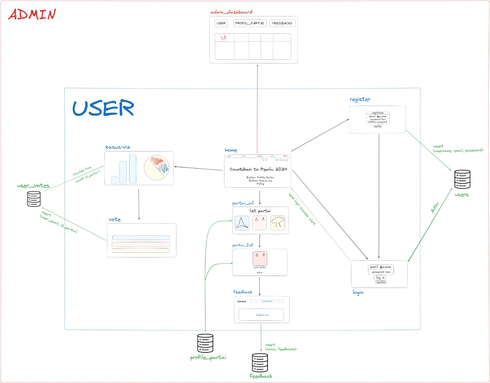

  <h1 style="margin: 0;">Welcome to KepoinPartai's GitHub!</h1>
  
<strong>Kelompok 3 | Basis Data SD-A2</strong>

    
  

    
  

---

## Our Members

  <table style="margin: 0 auto; width: 70%;">
    <tr>
      <th>Name</th>
      <th>GitHub</th>
      <th>Student Number</th>
    </tr>
    <tr>
      <td>Michael Adi Herryanto</td>
      <td><a href="https://github.com/michaelah0">@michaelah0</a></td>
      <td>162112133024</td>
    </tr>
    <tr>
      <td>Vinnie Quartasyeba Tarigan</td>
      <td><a href="https://github.com/vinnieqt">@vinnieqt</a></td>
      <td>162112133051</td>
    </tr>
    <tr>
      <td>Naila Shakira</td>
      <td><a href="https://github.com/bluepeailla">@bluepeailla</a></td>
      <td>162112133052</td>
    </tr>
    <tr>
      <td>Ridho Pandhu Afrianto</td>
      <td><a href="https://github.com/reiness">@reiness</a></td>
      <td>162112133062</td>
    </tr>
    <tr>
      <td>Dhia Alif Tajriyaani Azhar</td>
      <td><a href="https://github.com/Zzybeanie">@Zzybeanie</a></td>
      <td>162112133079</td>
    </tr>
  </table>

  

## Our Flow

 

# Topik Studi Kasus

**Peran Website 'Kepoin Partai' dalam Meningkatkan Kesadaran Politik dan Partisipasi Masyarakat di Indonesia**

**Bidang:** Sosial, politik
 
## Deskripsi Bidang Aplikasi

'Kepoin Partai' adalah sebuah website yang bertujuan untuk menyediakan platform online yang komprehensif dan informatif mengenai partai politik di Indonesia. Website ini akan mengintegrasikan data dari berbagai partai politik yang akan bersaing dalam Pemilihan Umum 2024. Website ini dirancang untuk memberikan akses mudah kepada masyarakat umum untuk memahami profil, sejarah, dan posisi partai-partai politik, serta data terkait seperti kasus korupsi dan hasil polling pengguna.

## Aturan Bisnis
- Setiap partai politik yang akan berpartisipasi dalam Pemilu harus terdaftar dalam sistem.
- Setiap halaman profil partai politik harus menyajikan data yang akurat dan terbaru.
- Informasi tentang tokoh-tokoh kunci dalam partai politik harus diperbarui secara berkala.
- Data kasus korupsi dan kerugian keuangan negara harus diupdate secara real-time jika ada perkembangan baru.
- Pengguna yang ingin berpartisipasi dalam polling harus terlebih dahulu login ke akun mereka.
- Setiap polling yang dilakukan oleh pengguna harus dicatat dan diakses oleh admin untuk analisis.

## Asumsi
- Sumber data yang digunakan untuk profil partai politik bersifat akurat dan dapat diandalkan.
- Pengguna akan memberikan masukan yang jujur dalam polling.
- Website ini akan diakses oleh berbagai kalangan masyarakat, termasuk yang memiliki minat politik yang beragam.

## Masalah
- Mengintegrasikan data dari berbagai sumber yang berbeda untuk menyajikan profil partai politik secara akurat dan konsisten.
- Menjaga keamanan data yang sensitif, terutama data pengguna yang login.
- Menyediakan visualisasi data yang informatif untuk memudahkan pengguna dalam memahami informasi politik.
- Memastikan bahwa data yang disajikan selalu diperbarui sesuai dengan perkembangan terkini.
- Mengelola dan menganalisis data hasil polling pengguna dengan efisien.

## Latar Belakang
Kepemimpinan presiden Jokowi dengan program-programnya telah menuntun Indonesia selama hampir sepuluh tahun. Waktu pemilu untuk memilih presiden yang dicalonkan partai politik pun mulai mendekat. Warna kampanye mulai terlukis perlahan-lahan di kota-kota besar, Surabaya tidak terkecuali. UUD NRI 1945 membatasi masa jabatan presiden menjadi dua kali periode berturut-turut di mana orang yang sama tidak dapat mencalonkan menjadi presiden kembali. Suatu peraturan yang secara tidak langsung membuat rakyat harus berpikir lebih dalam karena tidak dapat memilih orang yang sama kembali untuk ketiga kalinya. 'Kepoin Partai' adalah suatu halaman yang berisi informasi-informasi hasil rangkuman data suatu partai politik. Pengunjung dapat menengok partai yang mencalonkan calon kepala negara dengan harapan agar keputusan berdasarkan informasi dan data dapat lebih mudah dibuat. Sebagian mungkin masih akan memilih secara acak atau bahkan tidak memilih dengan sengaja melubangi setiap bagian dari kertas pemilu maupun tidak melubangi sama sekali, namun besar harapan kami bahwa informasi yang kami sediakan dapat memperkokoh maupun mengubah pilihan seseorang.

## Mission Statement
Database kami menjadi pondasi utama dalam mencapai tujuan kami. Database yang canggih dan terstruktur akan membantu kami:
- Memberikan pemahaman yang lebih mendalam tentang partai-partai politik, menjawab pertanyaan masyarakat tentang latar belakang, ideologi, dan program partai.
- Menghasilkan analisis yang akurat mengenai rekam jejak partai politik, membantu pemilih untuk membuat keputusan yang terinformasi.
- Menyediakan akses mudah dan cepat ke data aktual, memungkinkan masyarakat untuk mengikuti perkembangan politik secara real-time.
- Mendorong partis
